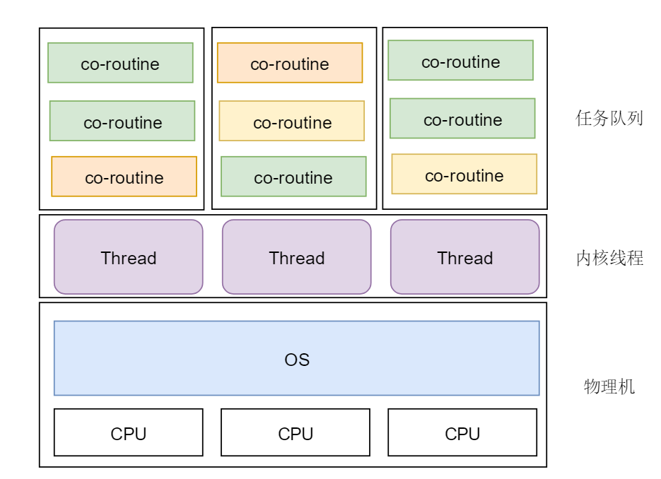

# 用户级进程实现
## 说明
核心代码来自于云风大佬的仓库，直接原封不动拿过来，然后又加了一些东西。

## 更改
1. 私以为云风大佬仅仅实现了切换任务，而没有实现真正的调度，所以其代码严格来说不是个调度器；因此我把之前的名字给改了，改成了：cswitcher, 仅仅用来切换任务用; 而调度器则是重新加上的新功能。
2. 引入了线程，但是该线程是用来配合调度使用而非工作线程。

## 架构
